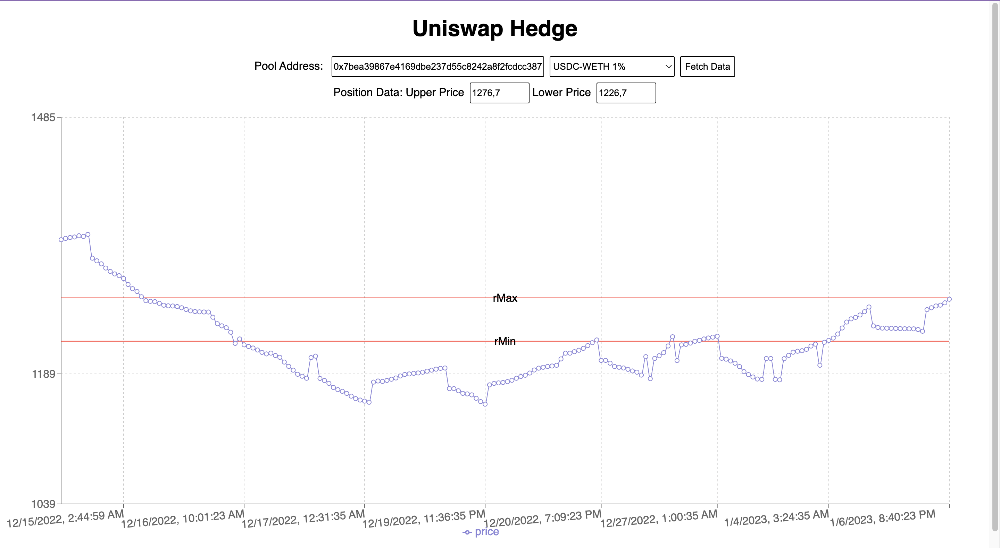

# DeFi Tools

Work in progress. This is a collection of tools for DeFi.

[](https://github.com/andpi314/defi-tools/actions/workflows/firebase-hosting.yml)


[Live demo](https://defi-tools-frontend.web.app/)

## Tools

A collection of tools for building and analyzing DeFi strategies.

### Uniswap Subgraph

```bash
https://api.thegraph.com/subgraphs/name/uniswap/uniswap-v3
```

## Deployment

How to deploy this project

### Firebase

Firebase login manager

```bash
firebase login:add {email}
firebase login:list
firebase login:use
```

### Next steps

- [ ] display ETH swaps and USDC swaps (to compute different amount of fees)
- [ ] Standardize yAxis across different pools (to have the same scale)
- [ ] Plot multiple pools on the same chart, to make it easier to compare
- [ ] compute fee (hint: integral)
- [ ] simulate short position, dynamically (parameters: triggerPrice, shortSize, hysteresis)

#### Project improvements

- [ ] https://github.com/vojtajina/grunt-bump
- [ ] Add Context State to improve data handling across components
